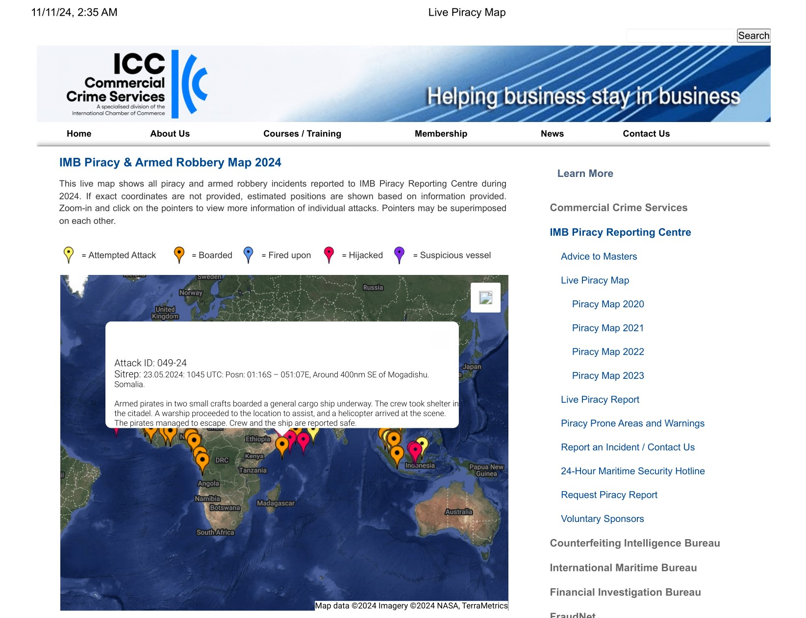

# Piracy Incident Reporting and Data Extraction Project

## Project Overview

This project focuses on scraping data related to piracy incidents from the live piracy map provided by ICC-CCS (International Chamber of Commerce - Commercial Crime Services). The scraper collects data for piracy incidents from the website for the years 2020 to 2024. The data is then processed and stored in an Excel file, including key details such as latitude, longitude, attack ID, date, situation report (sitrep), location, and description.

### Key Features:
- **Data Scraping:** Scrapes piracy incident data from multiple years (2020–2024).
- **Data Processing:** Extracts detailed information from each incident using regular expressions.
- **Data Storage:** Stores the data in an Excel sheet for easy analysis.
- **Sorting:** Organizes the data in descending order based on the incident date.
  
## Technologies Used:
- **Python** (with libraries: Selenium, Pandas, Requests, re)
- **Selenium WebDriver** (for web scraping)
- **Pandas** (for data processing and Excel output)
- **Regular Expressions** (for extracting specific data)


## **Useful Resources**
- [Visit IMB Piracy Reporting Center](https://www.icc-ccs.org/index.php/piracy-reporting-centre/live-piracy-report)
  
## Setup Instructions:

1. **Install Required Libraries:**
   Install the necessary Python libraries by running:
   ```bash
   pip install selenium pandas requests python-dotenv
   ```

2. **Setup WebDriver:**
   Ensure you have the [ChromeDriver](https://sites.google.com/a/chromium.org/chromedriver/) installed on your system and the path is added to your environment variables.


3. **Run the Script:**
   Execute the Python script to start scraping and processing the data:
   ```bash
   python piracy_data_scraper.py
   ```

## Output:

The data will be saved as `incident_data_with_extracted_details.xlsx` containing the extracted piracy incident details sorted by year, month, and day.

### Sample Data Columns:
- **Latitude:** The latitude of the incident location.
- **Longitude:** The longitude of the incident location.
- **Attack ID:** A unique identifier for the piracy attack.
- **Date:** The date of the incident.
- **Sitrep:** Situation report for the incident.
- **Location:** The location of the incident.
- **Description:** Additional description or details about the incident.

## Example Image of Website

Here is a screenshot of the piracy map website:



## Contribution

Feel free to fork the repository and contribute to the project. Pull requests are welcome for improvements or feature additions.

---

### License:
This project is open-source and available under the MIT License.
